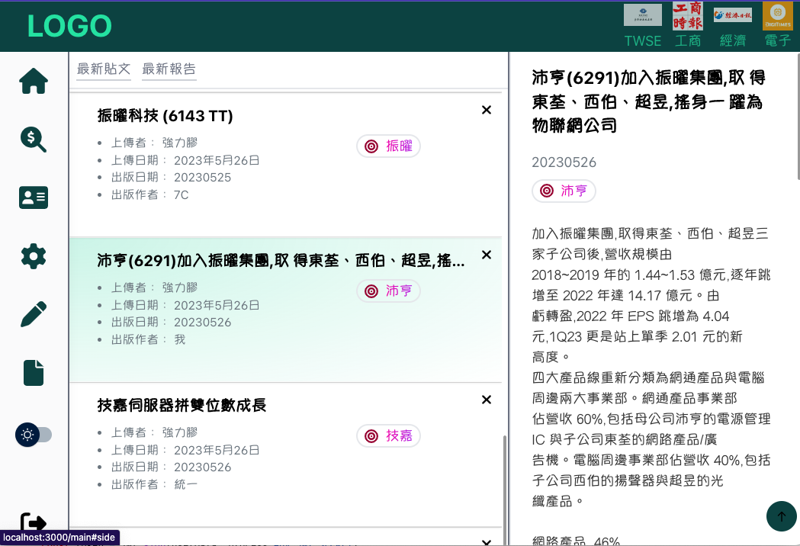

# Report Sharing Web Application
This web application is designed to facilitate the uploading and sharing of reports and insights among users. It provides a convenient platform for users to collaborate and exchange information within the context of brokerage institutional reports.

## deploy on 
[gh-pages](https://davelin18yufan.github.io/Stock-report-frontend)

## Features
+ **User Authentication**: Users are required to log in to access the application, ensuring a secure and private environment for report sharing.

+ **Report Upload**: Users can easily upload their reports to the platform, making them accessible to other members of the community.

+ **Insights Sharing**: Users can share their insights and thoughts on specific reports, fostering discussions and knowledge exchange.

+ **Collaborative Environment**: The application promotes collaboration among users, allowing them to engage in meaningful conversations, provide feedback, and learn from one another.

Technologies Used
Frontend: The frontend of the application is built using React, a popular JavaScript framework for building user interfaces. The UI design is implemented with the help of Tailwind CSS, a utility-first CSS framework.

Backend: The backend of the application is powered by Node.js, providing a robust and scalable server environment. Data is stored and managed using MySQL, a reliable relational database management system.

## Getting Started

To run the application locally, follow these steps:

1. Clone the repository: `git clone https://github.com/your/repository.git`
2. Install the dependencies: `npm install`
3. Set up the database and configure the connection details in the `.env` file.

    [database repository](https://github.com/davelin18yufan/Stock-report-backend)

4. Start the development server: `npm start`

## Technologies Used

__Frontend__: The frontend of the application is built using React, a popular JavaScript framework for building user interfaces. The UI design is implemented with the help of Tailwind CSS, a utility-first CSS framework.

__Backend__: The backend of the application is powered by Node.js with express.js, providing a robust and scalable server environment. Data is stored and managed using MySQL, a reliable relational database management system.

### Contributing
Contributions are welcome! If you encounter any issues or have suggestions for improvements, please open an issue or submit a pull request.

This project was bootstrapped with [Create React App](https://github.com/facebook/create-react-app).
